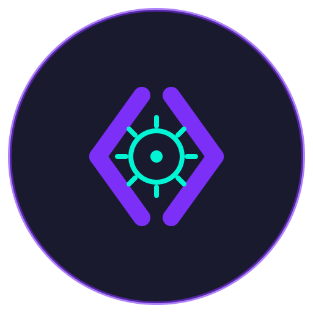

<p align="center">
  
</p>

<h1 align="center">CodeLogic Libraries</h1>

<p align="center">
  <a href="LICENSE"></a>
  
  <a href="https://media2a.github.io/CodeLogic.Libs/"></a>
</p>

<p align="center">
  Twelve production-ready .NET 10 library integrations for
  <a href="https://github.com/Media2A/CodeLogic">CodeLogic 4</a>.
  Each is a self-contained <code>ILibrary</code> with auto-generated configuration,
  lifecycle management, and health checks.
</p>

## Libraries

| Package | Version | Description |
|---------|---------|-------------|
| [CodeLogic.Common](CL.Common/) | [](https://www.nuget.org/packages/CodeLogic.Common) | Utility toolkit — encryption, hashing, ID/password generation, JSON, cron, imaging, networking |
| [CodeLogic.MySQL2](CL.MySQL2/) | [](https://www.nuget.org/packages/CodeLogic.MySQL2) | MySQL / MariaDB / Percona — typed LINQ → SQL, result cache, schema-sync modes, migrations |
| [CodeLogic.PostgreSQL](CL.PostgreSQL/) | [](https://www.nuget.org/packages/CodeLogic.PostgreSQL) | PostgreSQL — multi-database, repository + query builder, table sync, backups |
| [CodeLogic.SQLite](CL.SQLite/) | [](https://www.nuget.org/packages/CodeLogic.SQLite) | SQLite — connection pool, WAL, repository + query builder, migration ledger |
| [CodeLogic.Mail](CL.Mail/) | [](https://www.nuget.org/packages/CodeLogic.Mail) | SMTP send, IMAP read + IDLE, and a lightweight template engine |
| [CodeLogic.StorageS3](CL.StorageS3/) | [](https://www.nuget.org/packages/CodeLogic.StorageS3) | Amazon S3 / Cloudflare R2 / MinIO object storage |
| [CodeLogic.SocialConnect](CL.SocialConnect/) | [](https://www.nuget.org/packages/CodeLogic.SocialConnect) | Discord webhooks + Steam Web API (profiles, bans, games, ticket auth) |
| [CodeLogic.NetUtils](CL.NetUtils/) | [](https://www.nuget.org/packages/CodeLogic.NetUtils) | DNSBL blacklist checking + MaxMind GeoIP2 location lookups |
| [CodeLogic.GameNetQuery](CL.GameNetQuery/) | [](https://www.nuget.org/packages/CodeLogic.GameNetQuery) | Game-server queries — Valve A2S/RCON (CS2/CSS) and Minecraft UDP/RCON |
| [CodeLogic.SystemStats](CL.SystemStats/) | [](https://www.nuget.org/packages/CodeLogic.SystemStats) | Cross-platform CPU, memory, process, and uptime stats |
| [CodeLogic.GitHelper](CL.GitHelper/) | [](https://www.nuget.org/packages/CodeLogic.GitHelper) | Git repository automation via LibGit2Sharp |
| [CodeLogic.TwoFactorAuth](CL.TwoFactorAuth/) | [](https://www.nuget.org/packages/CodeLogic.TwoFactorAuth) | TOTP 2FA with QR-code generation |

All packages target **.NET 10** and depend on **CodeLogic 4** (range `[4.0.0, 5.0.0)`).

## Quick start

### 1. Install

```bash
# The CodeLogic framework comes in transitively — install only the libraries you need.
dotnet add package CodeLogic.MySQL2
dotnet add package CodeLogic.Mail
```

### 2. Load & start

Register each library **before** `ConfigureAsync()`, then run the lifecycle:

```csharp
using CodeLogic;

var init = await CodeLogic.InitializeAsync(o => { o.AppVersion = "1.0.0"; });
if (!init.Success) return 1;

await Libraries.LoadAsync<CL.MySQL2.MySQL2Library>();
await Libraries.LoadAsync<CL.Mail.MailLibrary>();

await CodeLogic.ConfigureAsync();   // generates/loads each library's config
await CodeLogic.StartAsync();       // runs Initialize → Start
```

Every library runs the same four-phase lifecycle automatically:
**Configure** (register config) → **Initialize** (open connections, build services) →
**Start** (health check, background workers) → **Stop** (graceful shutdown).

### 3. Configure

On first run each library writes a JSON config file with defaults into its own directory under
`Libraries/<LibraryId>/` — for example `config.mysql.json`, `config.mail.json`. Edit and restart.
Validation runs on startup, so invalid config stops the boot with a clear error.

### 4. Use

```csharp
var mysql = Libraries.Get<CL.MySQL2.MySQL2Library>();

var users = await mysql.Query<UserRecord>()
    .Where(u => u.IsActive && u.Role == "admin")
    .OrderBy(u => u.Name)
    .WithCache(TimeSpan.FromMinutes(5))
    .ToPagedListAsync(page: 1, pageSize: 20);
```

## How libraries work

Every CodeLogic library follows the same shape:

1. **`ILibrary` implementation** — the lifecycle hooks.
2. **Config model** (`ConfigModelBase`) — auto-generated JSON, validated on startup.
3. **Service classes** — the actual functionality, reached through the library instance.
4. **Health check** — reports Healthy / Degraded / Unhealthy via `HealthCheckAsync()`.

Libraries load before your application starts and stop after it stops, so your code can always
rely on database connections, mail services, and the rest being available.

```csharp
// Resolve a loaded library anywhere in your code:
var mysql = Libraries.Get<CL.MySQL2.MySQL2Library>();
var repo  = mysql.GetRepository<UserRecord>();
```

Most operations return `Result` / `Result<T>` rather than throwing for expected failures
(a few libraries — Mail, GitHelper, NetUtils — use their own result types; see their docs).

## Documentation

📖 **Full documentation: [media2a.github.io/CodeLogic.Libs](https://media2a.github.io/CodeLogic.Libs/)**

- [Getting Started](https://media2a.github.io/CodeLogic.Libs/getting-started.html)
- [All Libraries](https://media2a.github.io/CodeLogic.Libs/libs/) — per-library guides
- [API Reference](https://media2a.github.io/CodeLogic.Libs/api/) — generated from source XML docs

Each package also ships a focused `README.md` and `CHANGELOG.md` in its folder.

## Requirements

- [CodeLogic 4](https://github.com/Media2A/CodeLogic)
- .NET 10 SDK or later

## License

MIT — see [LICENSE](LICENSE).
